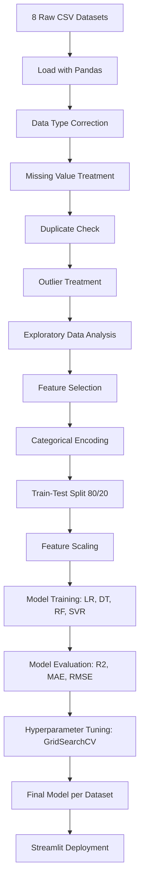
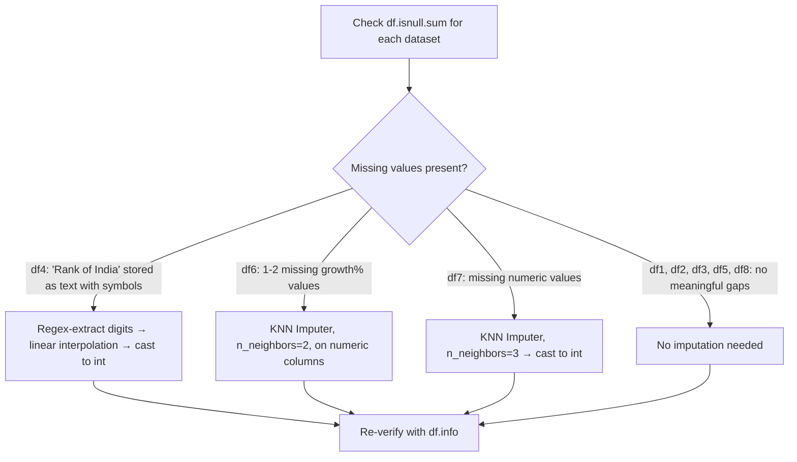
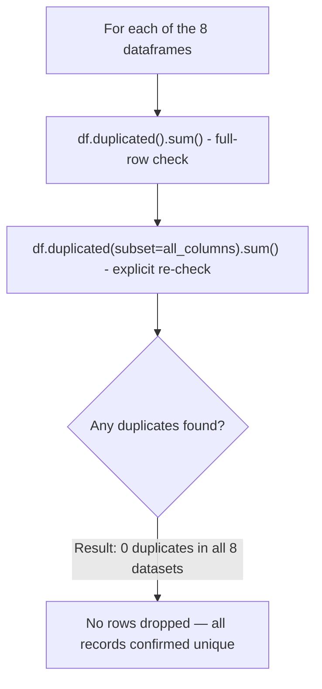
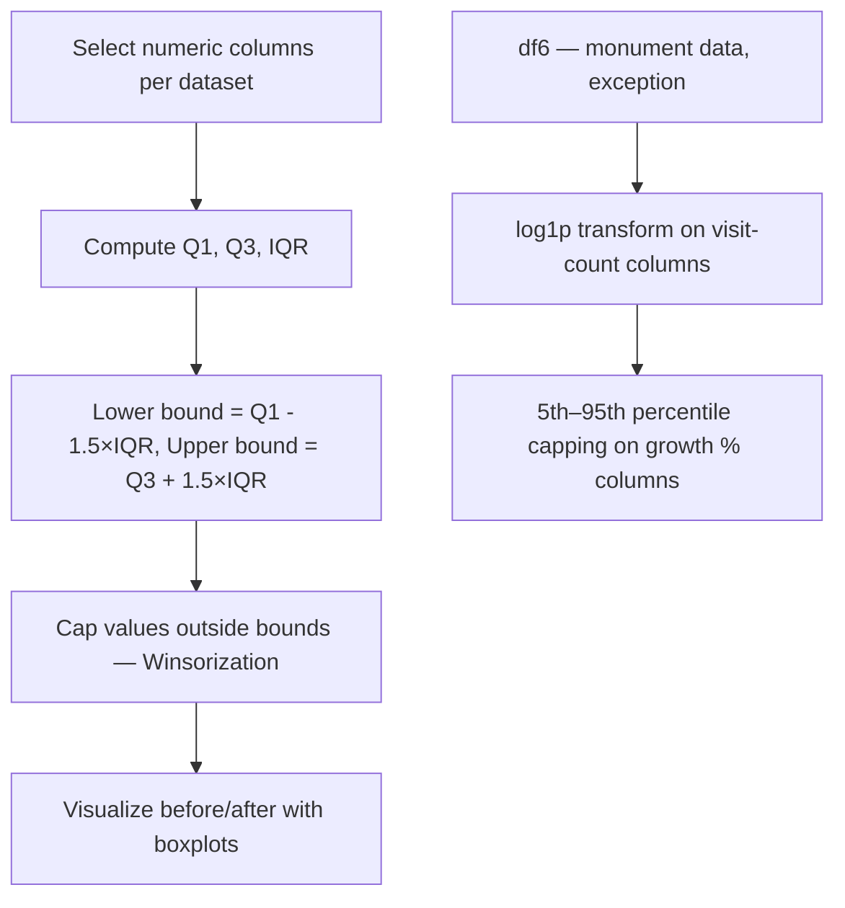
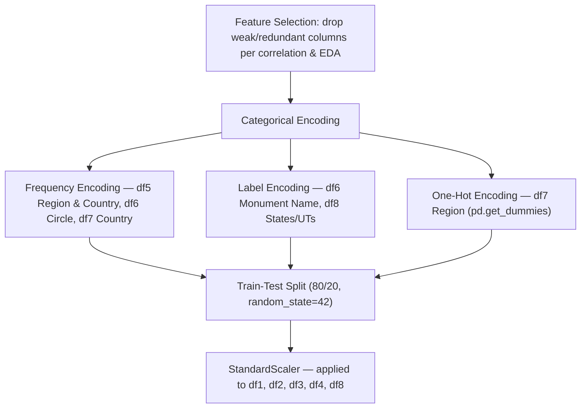
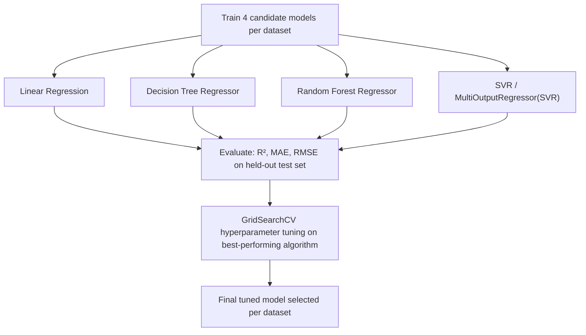

# Tourism in India — Data Analysis & Forecasting

An end-to-end machine learning project that cleans, analyzes, and models **8 official Government of India tourism datasets (1981–2021)** to forecast tourist inflow trends, understand traveler demographics, and support data-driven tourism planning. The project is deployed as an interactive **Streamlit** application.

---

## 1. Problem Statement

India's tourism data is published across multiple disconnected government releases — foreign/NRI/Indian-origin arrivals since 1981, age-group profiles, quarterly seasonality, India's global ranking, region- and purpose-of-visit breakdowns, monument-wise footfall, and state-wise domestic/foreign visits. Because this data lives in separate, inconsistently formatted files, tourism boards, policymakers, and travel businesses have no single, reliable view of **how tourist inflow is changing, who is traveling, when they travel, where they go, and how COVID-19 disrupted this pattern.**

**This project aims to:**
1. Consolidate and clean 8 fragmented tourism datasets into analysis-ready form.
2. Perform exploratory analysis to uncover demographic, seasonal, regional, and pandemic-recovery patterns in Indian tourism.
3. Build and evaluate regression models that forecast key tourism metrics — national arrivals, age-group share, quarterly share, world ranking, country/region-wise arrivals, monument footfall, and state-wise visitor totals.
4. Package the analysis and models into a Streamlit app so non-technical stakeholders can explore trends and forecasts interactively.

## 2. Business Objective / Value

| Stakeholder | How this project helps |
|---|---|
| Ministry of Tourism / Policy makers | Forecast national arrivals; identify which age groups and regions are shrinking or growing, to target policy (visa ease, safety, subsidies). |
| State Tourism Boards | Know which states lead in domestic vs. foreign visitation, to plan infrastructure and marketing budgets. |
| Archaeological Survey of India / Monument authorities | Predict monument-level footfall recovery post-COVID for staffing and conservation planning. |
| Travel & Hospitality businesses | Identify peak quarters (seasonality) and top source countries to time promotions and capacity. |
| Researchers/Analysts | A cleaned, reproducible reference dataset + models for further tourism-economics research. |

## 3. Datasets Used

| # | File | Description | Rows (post-clean) |
|---|---|---|---|
| df1 | `1981-2020-fta_nri_ita.csv` | Yearly FTAs, NRI, and ITA arrivals in India | 22 |
| df2 | `2001-2019-agegroup.csv` | Yearly age-group % distribution of foreign tourists | 19 |
| df3 | `2001-2019-quaterly.csv` | Yearly quarter-wise % distribution of arrivals | 19 |
| df4 | `2001-2019-worldvsindia.csv` | World vs. India arrivals, % share, and India's world rank | 21 |
| df5 | `2019_region-and-reason.csv` | Country/region-wise arrivals by purpose of visit (2019) | 73 |
| df6 | `2021-monuments.csv` | Domestic/foreign footfall at monuments, 2019-20 vs 2020-21 | 144 |
| df7 | `region-2017-2019.csv` | Country/region-wise arrivals, 2017–2019 | 73 |
| df8 | `statewise_2019-2020_domestic_foreign.csv` | State/UT-wise domestic & foreign visits, 2019 vs 2020 | 37 |

## 4. Overall Project Workflow



## 5. Data Cleaning

### 5.1 Missing Value Handling

Missing values were not uniform across datasets — each required a different fix:



### 5.2 Duplicate Check



### 5.3 Outlier Treatment



*Note: df6 was treated differently because raw visitor counts were extremely right-skewed (some monuments near-zero footfall during COVID vs. very high-traffic sites); a log transform stabilized variance better than IQR capping alone.*

## 6. Exploratory Data Analysis — Key Insights

**National arrivals (df1):** Foreign Tourist Arrivals (FTAs) have grown steadily since 1981. NRI arrivals show a mild declining trend, while year and "% change over previous year" are largely independent of each other.

**Age-group profile (df2):** The **25–54 age band contributes the highest share** of arrivals and should be the core targeting segment. The 15–24 group declined the most (2013–2019) — student exchange programs and youth-travel schemes could reverse this. The 35–44 group is growing, aligning with family/leisure travel.

**Seasonality (df3):** Arrivals peak in **Q4 (Oct–Dec)**, driven by the festive season (e.g., Diwali) and pleasant weather — the best window for cultural tourism marketing. **Q3 (Jul–Sep)**, the monsoon period, sees the steepest drop. Q1 (Jan–Mar) also softens, likely because it overlaps with working months abroad and in India.

**World standing (df4):** India's global arrivals and world tourism share were improving through 2017, then fell sharply from 2019 onward due to COVID-19, alongside a decline in India's world rank in that period.

**Region & purpose of visit, 2019 (df5):** **Western Europe** is the top source region (23.3% share); Australasia and North America are the smallest (4.1% each). **Bangladesh** is India's single largest source country by arrivals. Arrivals are positively correlated with the "Indian Diaspora" travel-purpose share — a large portion of high-volume source countries' travelers are of Indian origin visiting family.

**Monuments (df6):** 2020-21 domestic and foreign footfall correlates strongly with pre-pandemic (2019-20) footfall — sites popular before COVID recovered proportionally faster, useful for prioritizing reopening/staffing.

**Region-wise arrivals 2017–2019 (df7):** Bangladesh is consistently the top source country across all three years — a stable, dependable market worth long-term investment (visa facilitation, direct connectivity).

**State-wise 2019–2020 (df8):** **Andhra Pradesh** leads in domestic tourist visits (both years); **Delhi** leads in foreign tourist visits (both years) — domestic and international tourists clearly favor different states, which should inform state-specific marketing (heritage/business hubs for foreign visitors vs. religious/regional attractions for domestic visitors).

## 7. Feature Engineering & Encoding



## 8. Model Building & Evaluation



### Results Summary

| Dataset | Prediction Target | Best Model | R² | MAE | RMSE |
|---|---|---|---|---|---|
| df1 | FTAs in India (1981–2020) | Random Forest (tuned) | **0.922** | 0.544 | 0.719 |
| df2 | Age-group % (15–24, 25–34) | Decision Tree | 0.942 | 0.216 | 0.290 |
| df3 | Quarterly % (Q2, Q4) | Random Forest (tuned) | -0.345 ⚠️ | 0.703 | 1.162 |
| df4 | World & India arrivals (million) | SVR (tuned) | -0.380 ⚠️ | — | — |
| df5 | Purpose-of-visit % | Random Forest (tuned) | 0.102 ⚠️ | 9.783 | 14.311 |
| df6 | Monument footfall 2020-21 | Random Forest (tuned) | 0.284 | 1.534 | 2.372 |
| df7 | Country arrivals, 2019 | Linear Regression | **0.994** | 5,298.7 | 10,171.6 |
| df8 | State-wise total tourists, 2020 | Random Forest (tuned) | **0.903** | 978,250 | 1,335,946 |

## 9. Honest Limitations (important for accuracy)

To keep this README truthful, three of the eight models are **not yet reliable** and should be labeled as "experimental" or excluded from production forecasts until improved:

- **df3 (quarterly) and df4 (world vs. India):** cross-validated R² scores are negative, meaning the models currently perform worse than simply predicting the mean. Root cause is very small sample size (~19–21 yearly rows) relative to model complexity.
- **df5 (purpose-of-visit %):** R² around 0.05–0.10 — essentially weak predictive power; purpose-of-visit % may depend on factors not captured in this dataset (e.g., visa type, season, global events).
- **df7's near-perfect 0.994 R²** is expected rather than suspicious — 2019 arrivals are naturally close to the 2017–2018 trend for the same country, so this is closer to short-term trend continuation than a hard forecasting problem; it's still valid but worth stating plainly in the README rather than presenting it as proof of a breakthrough model.

**Recommended next steps before/while finishing deployment:**
- For df3/df4/df5, collect additional historical years or granular (monthly/state-level) data to increase sample size, or reduce model complexity (e.g., simple trend/regularized linear models instead of tree ensembles).
- Consider clearly separating "reliable forecasts" (df1, df7, df8) from "directional/experimental insights" (df2, df3, df4, df5, df6) in the Streamlit UI, so users don't over-trust weak models.

## 10. Tech Stack

- **Language:** Python
- **Data handling:** pandas, numpy
- **Visualization:** matplotlib, seaborn
- **ML:** scikit-learn (LinearRegression, DecisionTreeRegressor, RandomForestRegressor, SVR, KNNImputer, GridSearchCV)
- **Deployment:** Streamlit

## 11. Deployment (Streamlit) — Status: ~45% complete

## 12. Project Structure (suggested)

```
Tourism-in-India/
├── All_Data_set_Tourism/        # raw CSVs
├── Tourism_in_india.ipynb       # analysis & modeling notebook
├── app.py                       # Streamlit app
├── models/                      # saved .pkl models per dataset
├── README.md
└── requirements.txt
```
